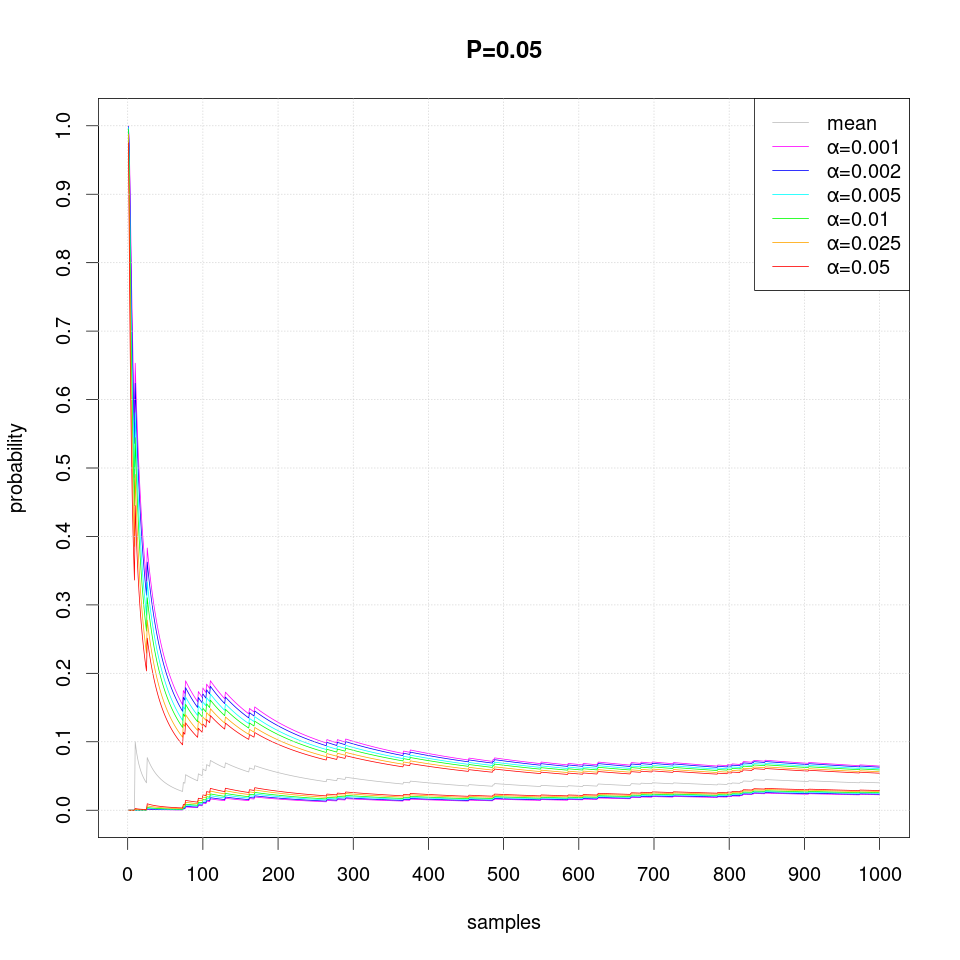
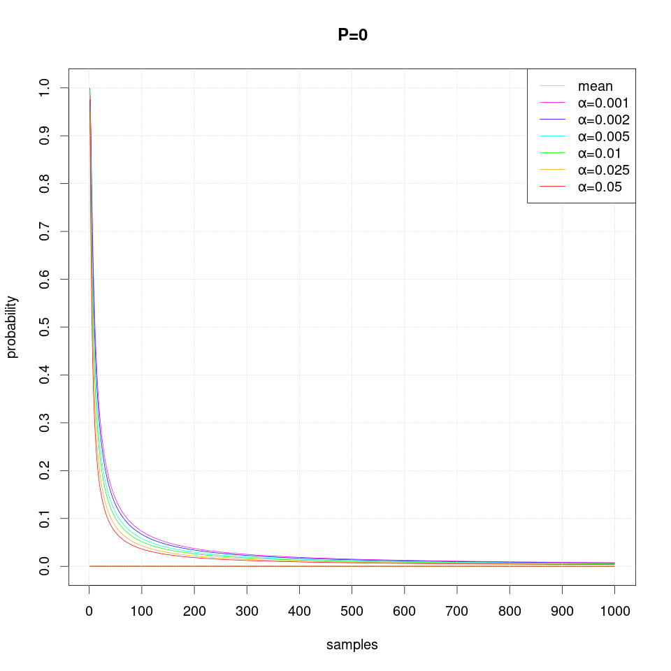
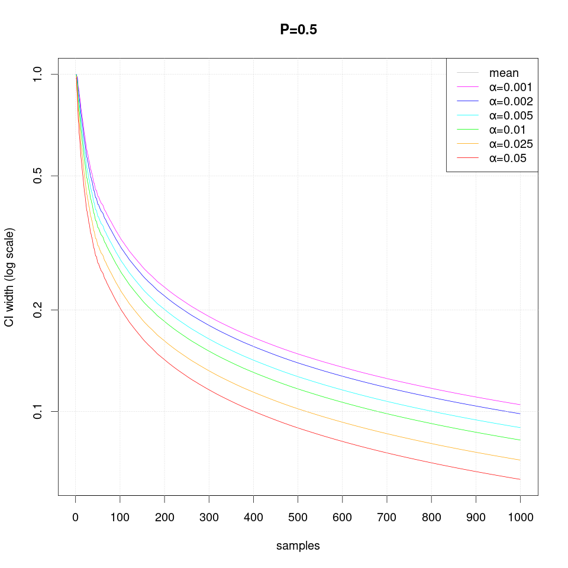
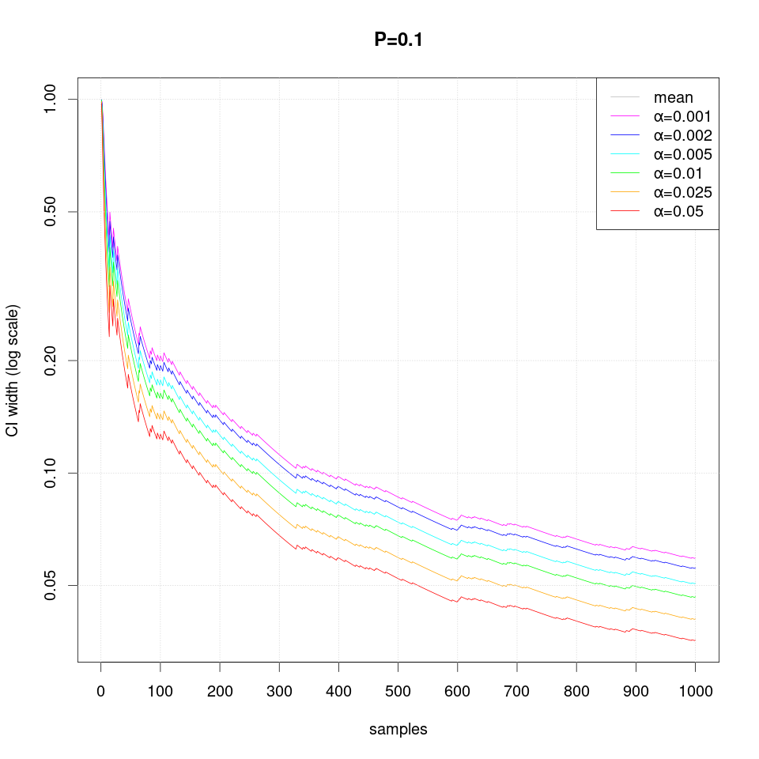
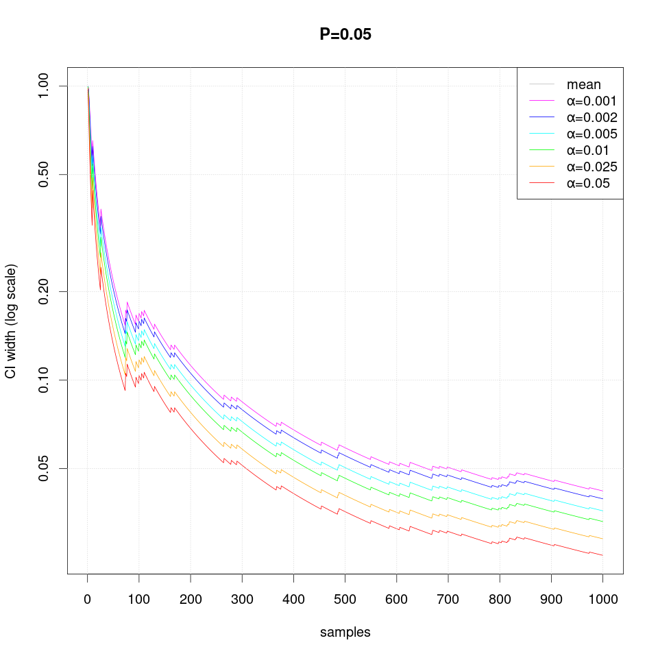
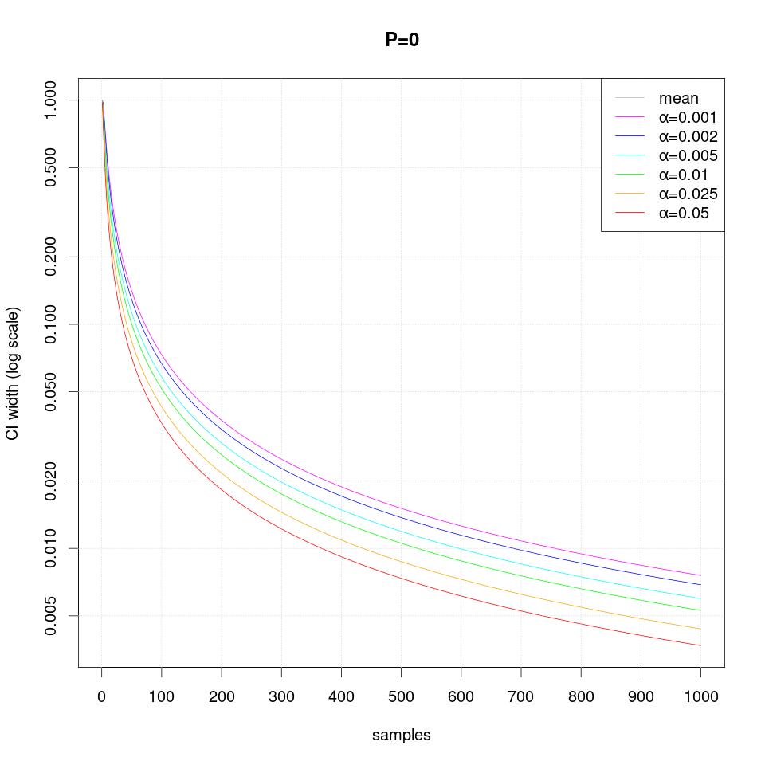

# Probability Confidence Interval Estimation

Chernoff-Hoffding bound provides an intuition that the number of required samples (runs) is inversely proportional to the square of the &epsilon; and proportional to the logarithm of inverse &alpha;:
<tt>N = ln(2/&alpha;) / (2&epsilon;2)</tt>. This result assumes that our measurements are sampled from a continuous interval <tt>[0,1]</tt> which makes it overly conservative. For example, for &alpha;=0.05 and &epsilon=0.05 it requires 738 runs and it does not depend on the probability itself.

Instead, UPPAAL uses Clopper-Pearson exact method for binomial (<tt>{0,1}</tt>) distribution which provides much more precise bounds with fewer runs, especially when the probability is close to 0 or 1.

If the number of runs is not specified in the query, then the probability estimation uses Clopper-Pearson algorithm sequentially to determine when to stop generating the simulation runs thus allowing earlier termination. Therefore the number of runs is sensitive to &alpha;, &epsilon; and also the estimated probability itself.

The following plots show the number of samples (runs) required to estimate the confidence interval using the exact method sequentially for a given &alpha;, &epsilon; and the true probability (estimating <tt>P>0.5</tt> is symmetric to estimating <tt>1-P</tt>):

For example, for the default parameter values &epsilon;=0.05 and &alpha;=0.05 the sequential algorithm required 411 &mdash; the highest number of samples (runs) when the probability close to 0.5 where the degree of uncertainty is the highest. Whereas the algorithm cannot distinguish the true probabilities <&epsilon;=0.05 and thus could terminate much earlier: after 72 runs. Note that the uncertainty of the required runs is the largest when the true probability is close to either 0 or 1.

The following plot shows the number of samples (runs) required when the width of the interval is halved to &epsilon;=0.025:

The following plot shows the number of samples (runs) required when the width of the interval is even more narrow &epsilon;=0.01:

The following series of plots demonstrates how the estimated confidence interval converges to the true probability P value as more samples are produced:

Note that occasionally the confidence intervals may overstep and thus exclude the true probability value, which should not happen more often than the specified level of significance α.

The following sequence of plots show how the width of the confidence intervals converges as more samples are produced:

Note that in case of extreme probability value (close to 0 or 1, e.g. P=0.01), repeated observations are more likely and thus they may create false confidence that the probability is extreme (i.e. 0 or 1), but then a single differing observation may disturb the interval size greately and therefore more samples are required than just single sided interval.
